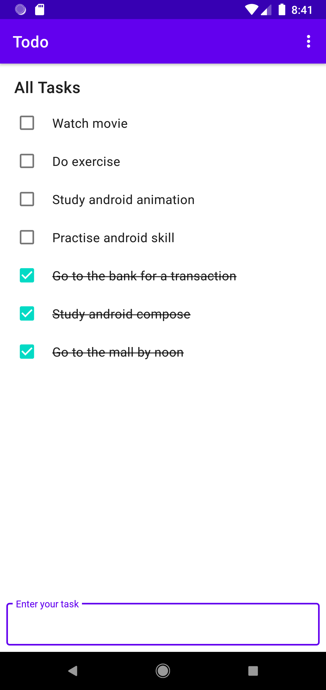

# Todo
Todo app using MVI design pattern

## Why this project
To practise android skill using MVI design pattern 

## Screenshot

## Reference
https://proandroiddev.com/best-architecture-for-android-mvi-livedata-viewmodel-71a3a5ac7ee3
